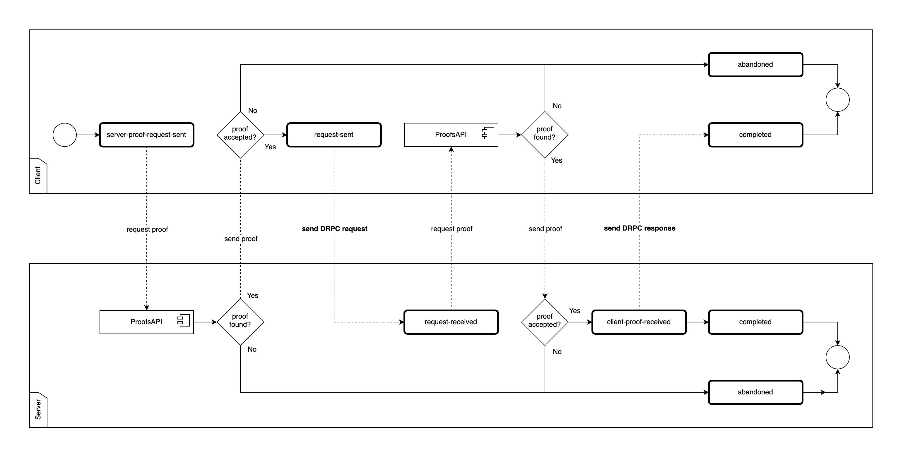

# veritable-cloudagent
The project aims to enable supply chains to share insights and data across multiple data platforms, enhancing the efficiency of the supply chain network. Specifically it facilitates the onboarding of new actors into a network, facilitating connections between those and allows for interaction between the actors. Interactions include issuance of credentials, acceptance of issued credentials, requesting proofs of credentials from other actors and those being able to verify those requests.


## Table of Contents
- [Attribution](#attribution)
- [Setup](#setup)
- [Getting Started](#getting-started)
- [Development Mode](#development-mode)
- [Environment Variables](#environment-variables)
- [Testing](#testing)
- [WebSocket and webhooks](#webSocket-and-webhooks)
- [Verified DRPC](#verified-drpc)
- [Schema Definition](#schema-definition)
- [Demoing credential issuance and verification](#demoing-credential-issuance-and-verification)

## Attribution
Thanks for all the hard work to everybody who contributed to the [project](https://github.com/openwallet-foundation/credo-ts-ext/tree/main). That project is under `Apache-2.0 license`


## Setup
The REST API provides an OpenAPI schema that can easily be viewed using the SwaggerUI (http://localhost:3000/swagger) that is provided with the server. The OpenAPI spec can be viewed on the `/api-docs` endpoint (e.g. http://localhost:3000/api-docs).

In case `npm i` fails with the references to the `node-gyp`. Please install xcode utilities by ruuning -> `brew install xcode`. Before executing `npm i` delete your node_modules in case it has some old references `rm -rf /node_modules`

#### DRPC Config
The RPC client can be configured through Envs, and follows the following format:

```
{
  ...,
  "verifiedDrpcOptions": {
    "proofTimeoutMs": <int> (timeout on proof requests, default: 5000),
    "requestTimeoutMs": <int> (timeout on DRPC requests, default: 5000),
    "credDefId": <string>, (credential definition ID to add to restrictions, can be easily set through "VERIFIED_DRPC_OPTIONS_CRED_DEF_ID" env)
    "proofRequestOptions": (proof options) <CreateProofRequestOptions<ProofProtocol[]>>
    }
  },
  ...
}
```

Note that the proof options must be set through envs due to the fact that a DRPC request handler is configured during initialisation.

### Prerequisites
- postgres:16.3+
- xcode utilities (node-gyp)
- npm 10.0.0+
- node 20.0.0+

## Getting started
The REST API provides an OpenAPI schema that can easily be viewed using the SwaggerUI (http://localhost:3000/swagger) that is provided with the server. The OpenAPI spec can be viewed on the `/api-docs` endpoint (e.g. http://localhost:3000/api-docs).

Bellow you will find commands for starting up the containers in docker (see the [Using Docker](#using-docker-easiest) section).

> The OpenAPI spec is generated from the model classes used by Aries Framework JavaScript. Due to limitations in the inspection of these classes, the generated schema does not always exactly match the expected format. Keep this in mind when using this package. If you encounter any issues, feel free to open an issue.

> In case `npm i` fails with the references to the `node-gyp`. Please install xcode utilities by ruuning -> `brew install xcode`. Before executing `npm i` delete your node_modules in case it has some old references `rm -rf /node_modules`

## Development mode
It is possible to configure the agent using environment variables. All properties are named in UPPER_SNAKE_CASE.

```sh
# With docker
docker run -e WALLET_KEY=my-secret-key ghcr.io/hyperledger/afj-rest ...

# Directly on computer
WALLET_KEY="my-secret-key" npx -p @credo-ts/rest afj-rest start ...
```

#### Single Agent
To get a minimal version of the agent running the following command is sufficient (uses `docker-compose.yml`):

```sh
docker-compose up --build -d
```

The agent is accessible via a `Swagger` interface (OpenAPI) on port `3000`. The API docs are available at `http://localhost:3000/api-docs`.

#### Single Agent + IPFS Node
The following command will spin up a single `afj` agent (named `Alice`), an IPFS node and a OpenPolicyAgent instance for testing purposes:

```sh
docker-compose -f docker-compose-agent-ipfs.yml up --build -d
```

This agent is also accessible via a `Swagger` (OpenAPI) interface on port `3000`.

#### Private 3-Agent Testnet
The following command will create a containerised private network consisting of 3 agents (`Alice`, `Bob` and `Charlie`) and a 3-node private IPFS cluster.

```sh
docker-compose -f docker-compose-testnet.yml up --build -d
```

This private testnet has the following ports available to the user for testing:

| Agent   | OpenAPI | HTTP | WS   |
| ------- | ------- | ---- | ---- |
| Alice   | 3000    | 5002 | 5003 |
| Bob     | 3001    | 5102 | 5103 |
| Charlie | 3002    | 5202 | 5203 |
| IPFS    |         | 8080 |      |
| OPA     |         | 8181 |      |

Network name: `testnet`

#### Starting Own Server
Starting your own server allows more fine-grained control over the settings and allows you to extend the REST API with custom endpoints.

You can create an agent instance and import the `startServer` method from the `rest` package. That's all you have to do.

```ts
import { startServer } from '@credo-ts/rest'
import { Agent } from '@credo-ts/core'
import { agentDependencies } from '@credo-ts/node'

// The startServer function requires an initialized agent and a port.
// An example of how to setup an agent is located in the `samples` directory.
const run = async () => {
  const agent = new Agent(
    {
      // ... AFJ Config ... //
    },
    agentDependencies
  )
  await startServer(agent, { port: 3000 })
}

// A Swagger (OpenAPI) definition is exposed on http://localhost:3000/swagger
run()
```

## Environment variables
The Envs are defined under `src > env.ts ` They are used to start up a container. They mostly have defaults and if you wish to overwrite these, provide them under `environment` in docker compose. For any envs that are an array of strings please provide them coma-separated like so: `- ENDPOINT=http://charlie:5002,ws://charlie:5003`.


| variable                                    | required | default                                                                                                                                                                                                | description                                                                                                                        |
| ------------------------------------------- | -------- | ------------------------------------------------------------------------------------------------------------------------------------------------------------------------------------------------------ | ---------------------------------------------------------------------------------------------------------------------------------- |
| LABEL                                       | Y        | "AFJ Rest"                                                                                                                                                                                             | A label that is used to identify the owner of the wallet                                                                           |
| WALLET_ID                                   | Y        | "walletId"                                                                                                                                                                                             | An id of the Agent's wallet                                                                                                        |
| WALLET_KEY                                  | Y        | "walletKey"                                                                                                                                                                                            | A key for the Agent's wallet                                                                                                       |
| ENDPOINT                                    | Y        | ['http://localhost:5002', 'ws://localhost:5003']                                                                                                                                                       | An array of endpoint for the agent app, if passing as an `environment` variable in docker, please pass as a comma delimited string |
| LOG_LEVEL                                   | Y        | info                                                                                                                                                                                                   | Log level for the app. Choices are trace, debug, info, warn, error or silent                                                       |
| USE_DID_SOV_PREFIX_WHERE_ALLOWED            | N        | false                                                                                                                                                                                                  | Allows the usage of 'sov' prefix in DIDs where possible                                                                            |
| USE_DID_KEY_IN_PROTOCOLS                    | N        | true                                                                                                                                                                                                   | Allows the use of DID keys in protocols                                                                                            |
| OUTBOUND_TRANSPORT                          | Y        | ['http', 'ws']                                                                                                                                                                                         | Specifies the type of outbound transport                                                                                           |
| INBOUND_TRANSPORT                           | Y        | "[{"transport": "http", "port": 5002}, {"transport": "ws", "port": 5003}]"                                                                                                                             | Specifies the inbound transport, needs to be provided as a JSON parseable string                                                   |
| AUTO_ACCEPT_CONNECTIONS                     | N        | false                                                                                                                                                                                                  | Allows for connection requests to be automatically acceptedupon being received                                                     |
| AUTO_ACCEPT_CREDENTIALS                     | N        | "never"                                                                                                                                                                                                | Allows for credentials to be automatically accepted upon being received                                                            |
| AUTO_ACCEPT_MEDIATION_REQUESTS              | N        | false                                                                                                                                                                                                  | Allows for mediatioons requests to be automatically accepted                                                                       |
| AUTO_ACCEPT_PROOFS                          | N        | "never"                                                                                                                                                                                                | Allows for proofs to be automatically accepted upon being received                                                                 |
| AUTO_UPDATE_STORAGE_ON_STARTUP              | N        | true                                                                                                                                                                                                   | Updates storage on startup                                                                                                         |
| BACKUP_BEFORE_STORAGE_UPDATE                | N        | false                                                                                                                                                                                                  | Creates a backup before the storage update                                                                                         |
| CONNECTION_IMAGE_URL                        | N        | "https://image.com/image.png"                                                                                                                                                                          | Url for connection image                                                                                                           |
| WEBHOOK_URL                                 | Y        | ['https://my-webhook-server']                                                                                                                                                                          | An array of webhook urls                                                                                                           |
| ADMIN_PORT                                  | Y        | 3000                                                                                                                                                                                                   | The port for the app                                                                                                               |
| IPFS_ORIGIN                                 | Y        | "http://ipfs0:5001"                                                                                                                                                                                    | The IPFS url endpoint                                                                                                              |
| PERSONA_TITLE                               | N        | "Veritable Cloudagent"                                                                                                                                                                                 | Tab name which you can see in your browser                                                                                         |
| PERSONA_COLOR                               | N        | "white"                                                                                                                                                                                                | Defines the background colour of swagger documentation                                                                             |
| OPA_ORIGIN                                  | N        | http://localhost:8181                                                                                                                                                                                  | OPA endpoint                                                                                                                       |
| STORAGE_TYPE                                | Y        | "postgres"                                                                                                                                                                                             | The type of storage to be used by the app                                                                                          |
| POSTGRES_HOST                               | N        | "postgres"                                                                                                                                                                                             | If type of storage is set to "postgres" a host for the database needs to be provided                                               |
| POSTGRES_PORT                               | N        | "postgres"                                                                                                                                                                                             | If type of storage is set to "postgres" a port for the database needs to be provided                                               |
| POSTGRES_USERNAME                           | N        | "postgres"                                                                                                                                                                                             | If type of storage is set to "postgres" a username for the database needs to be provided                                           |
| POSTGRES_PASSWORD                           | N        | "postgres"                                                                                                                                                                                             | If type of storage is set to "postgres" a password for the database needs to be provided                                           |
| VERIFIED_DRPC_OPTOPNS_PROOF_TIMEOUT_MS      | N        | 5000                                                                                                                                                                                                   | Timeout in ms on proof requests                                                                                                    |
| VERIFIED_DRPC_OPTIONS_REQUEST_TIMEOUT_MS    | N        | 5000                                                                                                                                                                                                   | Timeout in ms for DRCP requests                                                                                                    |
| VERIFIED_DRPC_OPTIONS_PROOF_REQUEST_OPTIONS | Y        | `{"protocolVersion": "v2", "proofFormats": {"anoncreds": {"name": "drpc-proof-request", "version": "1.0", "requested_attributes": {"companiesHouseNumberExists": {"name": "companiesHouseNumber"}}}}}` | Options for proof request                                                                                                          |
| VERIFIED_DRPC_OPTIONS_CRED_DEF_ID           | N        | "some-cred-def-id"                                                                                                                                                                                     | Credential definition id for verified DRPC                                                                                         |
| persona-title                               | N        | `Veritable Cloudagent`                                                                                                                                                                                 | Site title for the service's OpenAPI documentation                                                                                 |
| persona-color                               | N        | `white`                                                                                                                                                                                                | CSS colour value for the service's OpenAPI documentation background                                                                |
## Testing
Unit tests and integration tests are defined in the top-level `tests` directory.

#### Unit
Unit test can be run with `npm run test`.

#### Integration
Integration tests, however, require the testnet orchestration to be deployed.

**If the testnet is already running locally:** (through the command `docker-compose -f docker-compose-testnet.yml up --build` for example), the integration tests can be run by first building the tests docker image and then running it against the testnet stack:

```
docker build --target test -t afj-rest-integration-tests . && \
docker run -it \
  --network=testnet \
  -e ALICE_BASE_URL=http://alice:3000 \
  -e BOB_BASE_URL=http://bob:3000 \
  -e CHARLIE_BASE_URL=http://charlie:3000 \
  afj-rest-integration-tests
```

**If the testnet is not already running:** The entire stack can be run with integration tests using the following command:

```
docker-compose \
  -f docker-compose-testnet.yml \
  -f docker-compose-integration-tests.yml \
  up --build --exit-code-from integration-tests
```

## Database
Database is managed by the third party library `credo-ts` and more specifically `askar`.

## WebSocket and webhooks
The REST API provides the option to connect as a client and receive events emitted from your agent using WebSocket and webhooks.

You can hook into the events listener using webhooks, or connect a WebSocket client directly to the default server.

The currently supported events are:

- `Basic messages`
- `TrustPing`
- `Connections`
- `Credentials`
- `Proofs`
- `DRPC`
- `Verified DRPC`

Webhook urls can be specified using the `WEBHOOK_URL` env.

When using the REST server as an library, the WebSocket server and webhook urls can be configured in the `startServer` and `setupServer` methods.

```ts
// You can either call startServer() or setupServer() and pass the ServerConfig interface with a webhookUrl and/or a WebSocket server

const run = async (agent: Agent) => {
  const config = {
    port: 3000,
    webhookUrl: ['http://test.com'],
    socketServer: new Server({ port: 8080 }),
  }
  await startServer(agent, config)
}
run()
```

The `startServer` method will create and start a WebSocket server on the default http port if no socketServer is provided, and will use the provided socketServer if available.

However, the `setupServer` method does not automatically create a socketServer, if one is not provided in the config options.

In case of an event, we will send the event to the webhookUrls with the topic of the event added to the url (http://test.com/{topic}).

So in this case when a connection event is triggered, it will be sent to: http://test.com/connections

The payload of the webhook contains the serialized record related to the topic of the event. For the `connections` topic this will be a `ConnectionRecord`, for the `credentials` topic it will be a `CredentialRecord`, and so on.

For the WebSocket clients, the events are sent as JSON stringified objects

## Verified DRPC
The Verified DRPC module is built on a clone of the credo-ts [DRPC package](https://github.com/openwallet-foundation/credo-ts/tree/main/packages/drpc), which supports request-response style messaging according to the [json-rpc spec](https://www.jsonrpc.org/specification).

In addition to RPC messaging, Verified DRPC adds a proof verification step on both the client (requester) and server (responder) peers. This is implemented by executing a proof request before sending an outbound DRPC request and before processing an inbound request. This is represented by the following states:



Verified DRPC request and responses are exposed through the `/verified-drpc/` REST endpoints, `verified-drpc` webhooks and `VerifiedDrpc` internal events.


## Schema Definition
The repo contains 'schema' folder with a schema body json which can be imported into ts files like so:

```
import _schema from './schema/schemaAttributes.json'
const schema = _schema as AnonCredsSchema
```

The Json file contains attributes required for a schema to be registered.
The attributes are:

- checkName => what kind of check this is (e.g. NASDAQ, Rev >500, Production Capacity etc)
- companyName => name of the company that is being checked (max 200 characters)
- companiesHouseNumber => unique identifier for companies provided by Companiess House (max 8 characters - alphanumeric)
- issueDate => date when this check was issued (dateInt e.g. 20230101 for 1st Jan 2023)
- expiryDate => date when this check expires (dateInt e.g. 20230101 for 1st Jan 2023)

The schema definition can be posted to `/schemas` to register it. Upon a successful call a response is returned with an 'id' property which refers to this schema and can be used to refer to the schema when creating a new credential definition like so:

```
{
  "tag": "myTestDefinition",
  "schemaId": "ipfs://example",
  "issuerId": "did:key:exampleDidKey"
}
```

(Note: Each credential definition is unique, because a different set of cryptographic materials is created each time.)

A credential definition can then be used to issue a credential which contains both information about an issuer of a credential and the check itself.
(Note: Because the schema and definition is saved on ipfs. One must have an instance of ipfs running or be connected to global ipfs when registering a schema and definition.)

## Demoing credential issuance and verification
This demo uses the containerised private network of 3 agents (`Alice`, `Bob` and `Charlie`) and a 3-node private IPFS cluster.

```sh
docker-compose -f docker-compose-testnet.yml up --build -d
```

| Name    | Role         | API                                     |
| :------ | :----------- | :-------------------------------------- |
| Alice   | **Issuer**   | [localhost:3000](http://localhost:3000) |
| Bob     | **Holder**   | [localhost:3001](http://localhost:3001) |
| Charlie | **Verifier** | [localhost:3002](http://localhost:3002) |

#### OOB connection
Before any communication between two agents, an out of band connection must be established. First establish a connection between Alice and Bob by POSTing with Alice to `http://localhost:3000/oob/create-invitation`.

```json
{
  "handshake": true,
  "handshakeProtocols": ["https://didcomm.org/connections/1.x"],
  "multiUseInvitation": true,
  "autoAcceptConnection": true
}
```

Use the `invitationUrl` to POST `http://localhost:3001/oob/receive-invitation-url` with Bob e.g.

```json
{
  "invitationUrl": "http://alice:5002,?oob=eyJAdHlwZSI6Imh0dHBzOi8vZGlkY29tbS5vcmcvb3V0LW9mLWJhbmQvMS4xL2ludml0YXRpb24iLCJAaWQiOiI3NDk3MTc0Yi02MzIwLTQ5ZWYtYmMyYS04Y2I3M2E3ZDJhYWEiLCJsYWJlbCI6IkFGSiBSZXN0IEFnZW50IiwiYWNjZXB0IjpbImRpZGNvbW0vYWlwMSIsImRpZGNvbW0vYWlwMjtlbnY9cmZjMTkiXSwiaGFuZHNoYWtlX3Byb3RvY29scyI6WyJodHRwczovL2RpZGNvbW0ub3JnL2Nvbm5lY3Rpb25zLzEuMCJdLCJzZXJ2aWNlcyI6W3siaWQiOiIjaW5saW5lLTAiLCJzZXJ2aWNlRW5kcG9pbnQiOiJodHRwOi8vYWxpY2U6NTAwMiwiLCJ0eXBlIjoiZGlkLWNvbW11bmljYXRpb24iLCJyZWNpcGllbnRLZXlzIjpbImRpZDprZXk6ejZNa2pNQ256UlhZWjR1ZlBSUmVKc0xjUkhROUhRUzZ3S1dUZXVDdjFSTFoyZVI2Il0sInJvdXRpbmdLZXlzIjpbXX0seyJpZCI6IiNpbmxpbmUtMSIsInNlcnZpY2VFbmRwb2ludCI6IndzOi8vYWxpY2U6NTAwMyIsInR5cGUiOiJkaWQtY29tbXVuaWNhdGlvbiIsInJlY2lwaWVudEtleXMiOlsiZGlkOmtleTp6Nk1rak1DbnpSWFlaNHVmUFJSZUpzTGNSSFE5SFFTNndLV1RldUN2MVJMWjJlUjYiXSwicm91dGluZ0tleXMiOltdfV0sImltYWdlVXJsIjoiaHR0cHM6Ly9pbWFnZS5jb20vaW1hZ2UucG5nIn0"
}
```

Create schema with Alice - POST `http://localhost:3000/schemas`

```json
{
  "issuerId": "did:key:z6MkrDn3MqmedCnj4UPBwZ7nLTBmK9T9BwB3njFmQRUqoFn1",
  "version": "1.0",
  "name": "string",
  "attrNames": ["checkName", "companyName", "companiesHouseNumber", "issueDate", "expiryDate"]
}
```

Use the `id` and `issuerId` returned by creating a as `schemaId` and `issuerId` to create a credential definition with Alice - POST `http://localhost:3000/credential-definitions`

```json
{
  "tag": "someCredDef",
  "schemaId": "ipfs://bafkreibx3sernhcqhh7tlu5lkur2npksgsxtle7niri7siopaf2whfviy4",
  "issuerId": "did:key:z6Mkk7yqnGF3YwTrLpqrW6PGsKci7dNqh1CjnvMbzrMerSeL"
}
```

From the response, save the new credential definition id.

The connection id to Bob (3001) is also needed. To fetch this, on Alice (3000) `GET /connections` with empty parameters. From the response, save the connection ID of the only connection. (If there is more than one connection, look for the one with a DID of the format `did:peer:<...>`)

Using these two values, on Alice (3000), `POST http://localhost:3000/credentials/offer-credential` with the following request body, replace `credentialDefinitionId` and `connectionId` with the values previously fetched:

```json
{
  "protocolVersion": "v2",
  "credentialFormats": {
    "anoncreds": {
      "credentialDefinitionId": "ipfs://bafkreicdeamqb5kqjs6sxffcera2k7lqi7lolmf4a2nvgwahxapwpsnxay",
      "attributes": [
        {
          "name": "checkName",
          "value": ""
        },
        {
          "name": "companyName",
          "value": ""
        },
        {
          "name": "companiesHouseNumber",
          "value": ""
        },
        {
          "name": "issueDate",
          "value": ""
        },
        {
          "name": "expiryDate",
          "value": ""
        }
      ]
    }
  },
  "autoAcceptCredential": "always",
  "connectionId": "5652c902-c0ce-4792-86aa-62e10bacca93"
}
```

Bob must now accept the credentials offer. To get the Bob's credential offer record ID, on Bob (3001) `GET /credentials`. If there is more than one credential, look for one with the state `offer-received`.

Using this credential ID `POST http://localhost:3001/credentials/{credentialRecordId}/accept-offer` with the following body, replacing `credentialRecordId` with the one previously fetched:

```json
{
  "autoAcceptCredential": "always"
}
```

<details>
  <summary>Example of an issued credential</summary>

```json
{
  "_tags": {
    "connectionId": "841d1016-278f-44fa-82c9-d34023711d7c",
    "credentialIds": ["5ca19083-1325-42dd-9e06-17326506c266"],
    "state": "done",
    "threadId": "dcaa6a3b-5924-473a-b866-94340fb68f9a"
  },
  "metadata": {
    "_anoncreds/credentialRequest": {
      "link_secret_blinding_data": {
        "v_prime": "7780384658720139883051520777737145609154845534058249238107616168677146440354815999489173180818556002623796392349623759810287924257858919253787022482374506783739110736544797024028886378848655808050835469953792943949086771743127711513528885689689149928515385980647022923107914714929238070342856381821023767770451017868663895496311571214765761584854759291179904150766620863370767033104057622669423839372026147701783055904618087679461301419201122943843063642985341761776737614666012546857527244553498335564257414434094184194466636576590173580184821524025551510352276882525848712373468409319155285422091616968569115294880633605680293196851923300",
        "vr_prime": null
      },
      "nonce": "297465335850252833804416",
      "link_secret_name": "8ed424ec-16d7-48a5-93f2-434601112848"
    },
    "_anoncreds/credential": {
      "credentialDefinitionId": "ipfs://bafkreicdeamqb5kqjs6sxffcera2k7lqi7lolmf4a2nvgwahxapwpsnxay",
      "schemaId": "ipfs://bafkreibx3sernhcqhh7tlu5lkur2npksgsxtle7niri7siopaf2whfviy4"
    }
  },
  "credentials": [
    {
      "credentialRecordType": "anoncreds",
      "credentialRecordId": "5ca19083-1325-42dd-9e06-17326506c266"
    }
  ],
  "id": "b3cc696b-428d-402f-8c4b-f864448c8517",
  "createdAt": "2023-12-07T17:23:04.966Z",
  "state": "done",
  "connectionId": "841d1016-278f-44fa-82c9-d34023711d7c",
  "threadId": "dcaa6a3b-5924-473a-b866-94340fb68f9a",
  "protocolVersion": "v2",
  "updatedAt": "2023-12-07T17:24:23.194Z",
  "credentialAttributes": [
    {
      "mime-type": "text/plain",
      "name": "checkName",
      "value": ""
    },
    {
      "mime-type": "text/plain",
      "name": "companyName",
      "value": ""
    },
    {
      "mime-type": "text/plain",
      "name": "companiesHouseNumber",
      "value": ""
    },
    {
      "mime-type": "text/plain",
      "name": "issueDate",
      "value": ""
    },
    {
      "mime-type": "text/plain",
      "name": "expiryDate",
      "value": ""
    }
  ],
  "autoAcceptCredential": "always"
}
```

</details>

#### Verification
Setup an out of band connection between Charlie and Bob. This can be acomplished via Implicit invitation.
In order to use the implicit invitation we need a public did hosted ‘somewhere on the internet’ for now we are using a did doc hosted on github pages. To host a did doc on your github:

For our did doc above we will need to generate a key-pair. This could be doe through https://mkjwk.org/ - setting parameters to `key type: OKP`, Ed25519 and you can see in the did doc below we will be using the public portion of the key.

Example key-pair will look like this:

```json
{
  "kty": "OKP",
  "d": "PRIVATE_KEY",
  "crv": "Ed25519",
  "x": "PUBLIC_KEY"
}
```

#### Publishing a web:did
1.  create public repo called `YOUR_USERNAME.github.io`
2.  in the repo you just created create folder `dids` in `dids` folder then create folder `1` in there create `did.json`
3.  body to include in your did.json:

    ```json
    {
      "@context": ["https://www.w3.org/ns/did/v1", "https://w3id.org/security/suites/jws-2020/v1"],
      "id": "did:web:YOUR_USERNAME.github.io:dids:1",
      "verificationMethod": [
        {
          "id": "did:web:YOUR_USERNAME.github.io:dids:1#owner",
          "type": "JsonWebKey2020",
          "controller": "did:web:YOUR_USERNAME.github.io:dids:1",
          "publicKeyJwk": {
            "kty": "OKP",
            "crv": "Ed25519",
            "x": "PUBLIC_KEY"
          }
        }
      ],
      "authentication": ["did:web:YOUR_USERNAME.github.io:dids:1#owner"],
      "assertionMethod": ["did:web:YOUR_USERNAME.github.io:dids:1:1#owner"],
      "service": [
        {
          "id": "did:web:YOUR_USERNAME.github.io:dids:1#did-communication",
          "type": "did-communication",
          "priority": 0,
          "recipientKeys": ["did:web:YOUR_USERNAME.github.io:dids:1#owner"],
          "routingKeys": [],

          "serviceEndpoint": "http://alice:5002"
        }
      ]
    }
    ```

4.  you can view your did in your browser like so: https://your_username.github.io/dids/1/did.json

#### Implicit Invitation

In order to send an invite from bob to Alice, Alice needs to be aware of the private key from keypair above and our did (above).
We need to import our did with the private key on Alice using endpoint `dids/import`:

```json
{
  "did": "did:web:YOUR_USERNAME.github.io:dids:1",
  "privateKeys": [
    {
      "keyType": "ed25519",
      "privateKey": "PRIVATE_KEY"
    }
  ]
}
```

Once the did and private key is successfully imported on Alice, we can attempt to use the implicit invitation endpoint on Bob via `oob/receive-implicit-invitation` body:

```json
{
  "did": "did:web:YOUR_USERNAME.github.io:dids:1",
  "handshakeProtocols": ["https://didcomm.org/connections/1.x"]
}
```

This creates a connection record for Bob and Alice - for both this record is in a state `request-sent` and `request-received` respectively.

To move the connection to a completed state - on Alice we take the connection id and use `connections/{connectionId}/accept-request` endpoint.

As the Verifier, request proof from Bob (Holder) with Charlie - POST `http://localhost:3002/proofs/request-proof`. Use the `connectionId` to Bob and the `cred_def_id` either from the credential definition created earlier by Alice or the credential owned by Bob (the credential definition ID is consistent across all agents because it's an IPFS CID).

```json
{
  "protocolVersion": "v2",
  "proofFormats": {
    "anoncreds": {
      "name": "proof-request",
      "version": "1.0",

      "requested_attributes": {
        "name": {
          "name": "checkName",
          "restrictions": [
            {
              "cred_def_id": "ipfs://bafkreicdeamqb5kqjs6sxffcera2k7lqi7lolmf4a2nvgwahxapwpsnxay"
            }
          ]
        }
      }
    }
  },
  "willConfirm": true,
  "autoAcceptProof": "always",
  "connectionId": "4b70e399-d0d3-42c9-b511-dc0b972e362d"
}
```

The proof must now be accepted by Bob - POST `http://localhost:3001/proofs/{proofRecordId}/accept-request` with the following body, replacing `proofRecordId` with the `id` of the proof from GET `http://localhost:3001/proofs`:

```json
{
  "useReturnRoute": true,
  "willConfirm": true,
  "autoAcceptProof": "always"
}
```

<details>
  <summary>Example of a verified proof on Charlie</summary>

```json
[
  {
    "_tags": {
      "connectionId": "4b70e399-d0d3-42c9-b511-dc0b972e362d",
      "state": "done",
      "threadId": "9b5fce7c-e0d2-4b72-a3f8-20d0934c11c7"
    },
    "metadata": {},
    "id": "d5e6433f-0666-4e04-bd31-580b6e570be4",
    "createdAt": "2023-12-11T18:19:46.771Z",
    "protocolVersion": "v2",
    "state": "done",
    "connectionId": "4b70e399-d0d3-42c9-b511-dc0b972e362d",
    "threadId": "9b5fce7c-e0d2-4b72-a3f8-20d0934c11c7",
    "autoAcceptProof": "always",
    "updatedAt": "2023-12-11T18:20:14.128Z",
    "isVerified": true
  },
  {
    "_tags": {
      "connectionId": "4b70e399-d0d3-42c9-b511-dc0b972e362d",
      "state": "request-sent",
      "threadId": "1771f381-ae65-42d2-b041-830fbf50ff85"
    },
    "metadata": {},
    "id": "03d72143-1b08-472a-8237-eda0c3e1c771",
    "createdAt": "2023-12-11T17:44:13.572Z",
    "protocolVersion": "v2",
    "state": "request-sent",
    "connectionId": "4b70e399-d0d3-42c9-b511-dc0b972e362d",
    "threadId": "1771f381-ae65-42d2-b041-830fbf50ff85",
    "autoAcceptProof": "always",
    "updatedAt": "2023-12-11T17:44:13.587Z"
  },
  {
    "_tags": {
      "connectionId": "4a99c6d8-66b1-46c3-b165-f3f426d39d4a",
      "state": "request-sent",
      "threadId": "8fa0c627-d9a4-43e5-8d7b-25691b5b30d0"
    },
    "metadata": {},
    "id": "707a731c-984b-4abd-88e7-7699fe1576f9",
    "createdAt": "2023-12-11T18:19:08.556Z",
    "protocolVersion": "v2",
    "state": "request-sent",
    "connectionId": "4a99c6d8-66b1-46c3-b165-f3f426d39d4a",
    "threadId": "8fa0c627-d9a4-43e5-8d7b-25691b5b30d0",
    "autoAcceptProof": "always",
    "updatedAt": "2023-12-11T18:19:08.575Z"
  }
]
```

</details>
